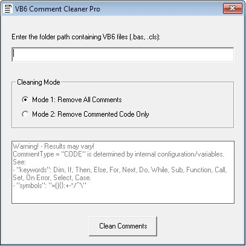

# VB6 Comment Cleaner Pro 🧹

[](https://www.gnu.org/licenses/agpl-3.0)

**Professional-grade tool for cleaning VB6 projects**, featuring intelligent comment removal and code preservation.

 <!-- Add a screenshot/GIF later -->

## Features ✨
- 🕹️ **Dual Cleaning Modes**  
  - **Mode 1**: Remove all comments  
  - **Mode 2**: Remove only commented code (preserves text comments)  
- 📝 **Garbage Logs** for auditing changes  
- 🛡️ **AGPL v3 Licensed** - Freedom to use, modify, and share  

## Installation 📥
1. Clone the repository:  
   ```bash
   git clone https://github.com/aidajulia/vb6-comment-cleaner-pro.git
   ```
2. Open VB6CommentCleanerPro.vbp in Visual Basic 6 IDE.

3. Compile to .exe (File → Make VB6CommentCleanerPro.exe).

## Usage 🖥️
1. Run the compiled .exe.

2. Select a directory containing VB6 files (.bas, .cls).

3. Choose cleaning mode:

    Mode 1: Remove All Comments

    Mode 2: Remove Commented Code Only

4. Check generated .garbage.log files for verification.

## Contributing 🤝
1. Report issues 🐛 [here](https://github.com/aidajulia/vb6-comment-cleaner-pro/issues)
2. Submit pull requests 🌟 [for features/bug fixes](https://github.com/aidajulia/vb6-comment-cleaner-pro/pulls)
3. Discuss improvements 💬 in [Discussions](https://github.com/aidajulia/vb6-comment-cleaner-pro/discussions)

## License 📜
This project is licensed under the GNU Affero General Public License v3.0.  
See [LICENSE](LICENSE) for details.
